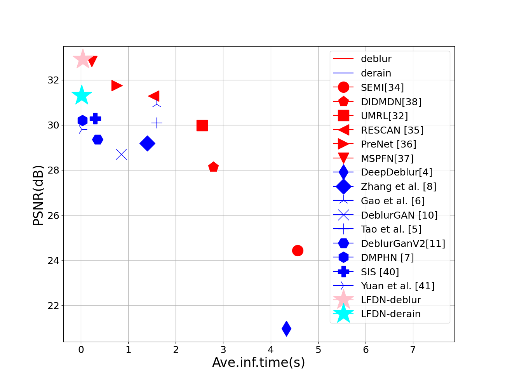
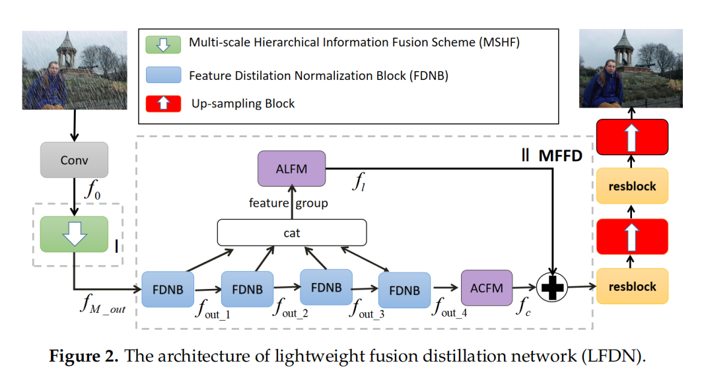
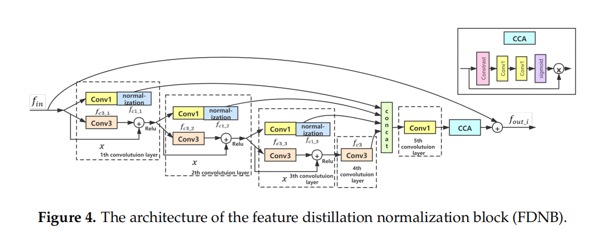
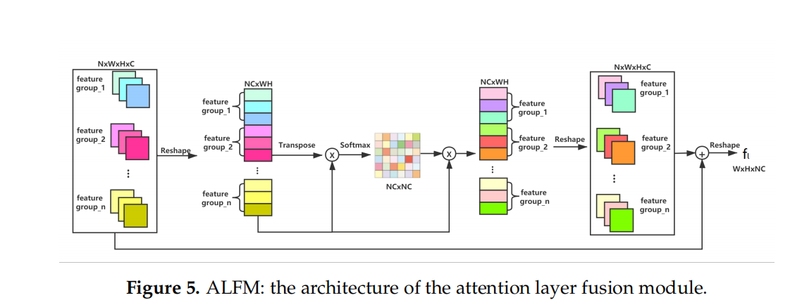
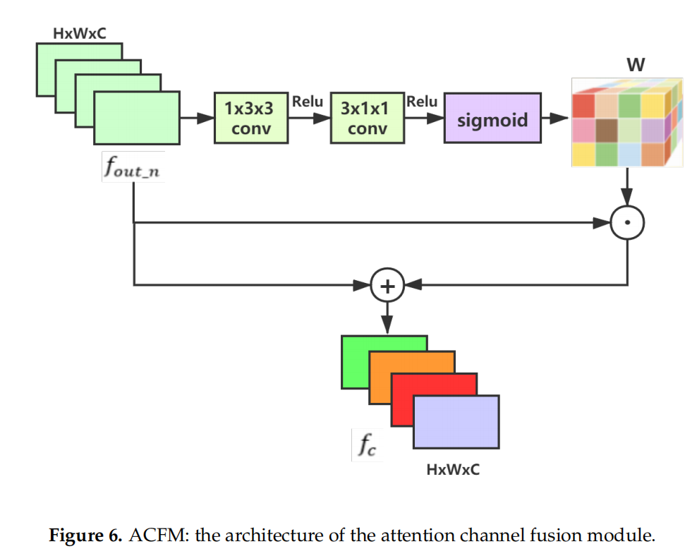
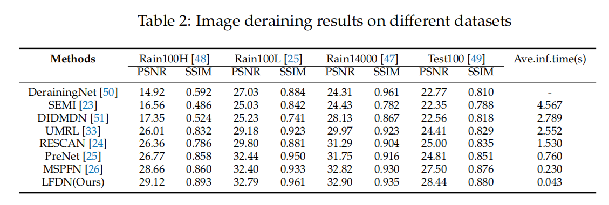
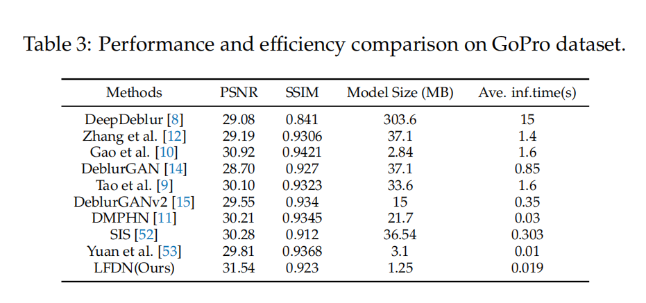
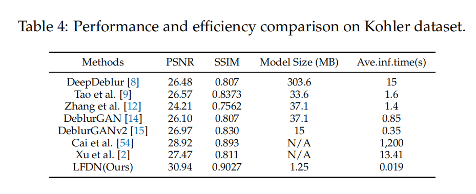
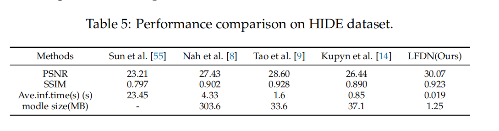

# Implementation for ：A Lightweight Fusion Distillation Network for Image Deblurring and Deraining

### The source codes for our published papers. We will release them later.

# Abstract

Recently, deep learning-based image deblurring and deraining have been well developed. However, most of these methods fail to distill the useful features. What’s more, exploiting the detailed image features in a deep learning framework always requires a mass of parameters, which inevitably makes the network suffer from a high computational burden. We propose a lightweight fusion distillation network (LFDN) for image deblurring and deraining to solve the above problems. The proposed LFDN is designed as an encoder-decoder architecture. In the encoding stage, the image feature is reduced to various small-scale spaces for multi-scale information extraction and fusion without much information loss. Then, a feature distillation normalization block is designed at the beginning of the decoding stage, enabling the network to distill and screen valuable channel information of feature maps continuously. Then, an information fusion strategy between distillation modules and feature channels is also carried out by the attention mechanism. By fusing different information in the proposed approach, our network can achieve state-of-the-art image deblurring and deraining results with a smaller number of parameters and outperform existing model complexity methods.

